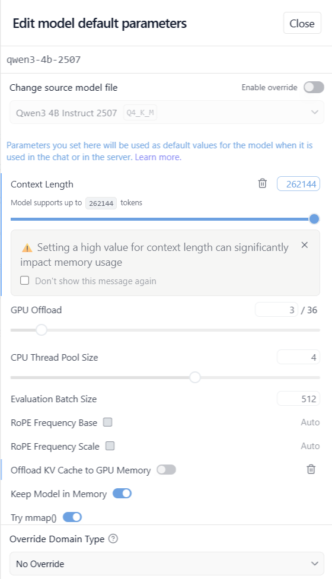
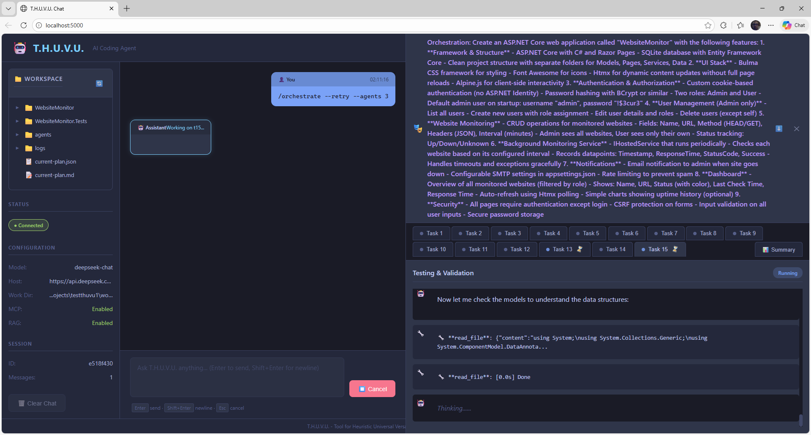

# T.H.U.V.U. — Tool for Heuristic Universal Versatile Usage


A **local-first AI coding agent** that performs software engineering tasks autonomously using local or cloud LLMs. It prioritizes privacy, autonomy, extensibility, and safety.

## Why this exists
I vibe-coded this agent using mainly ChatGPT and GitHub Copilot in order to better understand the mechanics of AI agents and see 
how far can I go by using local LLMs. I did this because I was disappointed by the current state of the cli tools
that use local LLMs and I wanted to create a simple agent that can use tools and chat with the user. Obviously,
the inspiration for this project is Claude Code and Gemini CLI. But I want to be able to run it locally,
without the need for an API key or internet connection. I also wanted to see how far I can go with a local LLM.

## Quick Start

### Prerequisites
- .NET 8.0 SDK
- Local LLM server (LM Studio) OR cloud API (DeepSeek, OpenAI-compatible)
- Optional: Docker for RAG database, Deno for MCP code execution

### Running THUVU

```bash
# Build the project
dotnet build

# Run with TUI (recommended)
dotnet run -- --tui

# Run with Web UI
dotnet run -- --web
# Then open http://localhost:5000

# Run in CLI mode
dotnet run
```

### Docker Deployment

```bash
cd docker

# Full stack with local Ollama LLM
docker-compose --profile full up -d

# With external LLM (edit .env first)
docker-compose up -d thuvu postgres-rag

# Pull models for Ollama (first time)
docker-compose --profile setup up
```

See [docker/README.md](docker/README.md) for detailed Docker deployment instructions.

## Supported Models and Providers
THUVU works with any OpenAI-compatible API:

**Local LLMs (via LM Studio or Ollama):**
- qwen/qwen3-coder-30b (recommended for coding tasks)
- qwen2.5-coder:14b (good balance of speed and capability)
- mistralai/devstral-small (fast, good for simpler tasks)
- Any model with tool/function calling support

**Cloud Providers:**
- DeepSeek API (deepseek-chat, deepseek-reasoner)
- OpenAI API
- Any OpenAI-compatible API endpoint

**LM Studio Setup:**
- LM Studio 0.3.23+ recommended
- Look for models with the hammer icon (tool calling support)
- Increase context window for complex tasks (increases memory usage)



## Features

### Core Features
- **LLM Integration**: Connect to local LLMs via LM Studio/Ollama, or cloud APIs
- **Multi-Model Support**: Configure multiple models with automatic selection based on task type
- **Model-Specific Prompts**: Each model can have its own system prompt template
- **Tool System**: 25+ tools for file operations, dotnet, git, NuGet, browser automation, and more
- **Permission System**: Granular permission control with persistence and Web UI approval dialog
- **Multiple Interfaces**: CLI, TUI (Terminal.GUI), and Web (Blazor Server) interfaces
- **Context Management**: Automatic summarization when context is near limit, token tracking
- **Tool Result Compression**: Automatic compression of large tool outputs to save tokens

### Web Interface
Modern Blazor Server web UI with real-time SignalR streaming:
- **Chat Interface**: Send messages and receive streaming responses
- **Workspace Browser**: Navigate and preview files with refresh button
- **Settings Panel**: Configure providers, agent settings, and features
- **Permission Dialog**: Approve or deny tool calls with Always/Session/Once/Deny options
- **Slash Commands**: Full support for all THUVU commands with autocomplete
- **File References**: Use `@filename` to include file contents in your message
- **Orchestration Panel**: Visual multi-agent task execution with per-task output
- **Screenshot Display**: View browser automation screenshots inline
- **Auto-Summarization**: Automatic context compression at 90% usage



### TUI Interface
Terminal.GUI-based multi-panel interface:
- **Multi-panel Layout**: Orchestrator output, agent tabs, and input area
- **Command Autocomplete**: Tab key for commands and file paths
- **Real-time Progress**: Tool execution with elapsed time display
- **Keyboard Navigation**: ESC to cancel, arrow keys for autocomplete

### Browser Automation
Playwright-based web browsing tools for research and testing:

```bash
# Install browsers (first time)
/browser install

# Navigate and interact
/browser open https://example.com
/browser click "button#submit"
/browser type "#search" "query text"
/browser screenshot

# Get page elements
/browser elements "a.nav-link"

# Execute JavaScript
/browser script "document.title"

# Close browser
/browser close
```

### Multi-Agent Orchestration
Decompose complex tasks and run multiple agents in parallel:

```bash
# Create a task decomposition plan
/plan Create an ASP.NET Core web app with authentication and database

# Run orchestration with multiple agents
/orchestrate --agents 3

# Resume after interruption
/orchestrate --retry

# Use TUI mode for visual progress
/orchestrate --tui
```

### System Prompts
Each model can have its own system prompt for optimized behavior:

```bash
# List available prompt templates
/prompt list

# Apply a template to current session
/prompt use coding

# Show current system prompt
/prompt show

# Reload prompt from model configuration
/prompt reload
```

Configure in `appsettings.json`:
```json
{
  "Models": {
    "Models": [
      {
        "ModelId": "deepseek-chat",
        "SystemPromptTemplate": "deepseek"
      },
      {
        "ModelId": "custom-model",
        "SystemPrompt": "@prompts/my-custom-prompt.md"
      }
    ]
  }
}
```

See [prompts/README.md](prompts/README.md) for template documentation.

### RAG (Retrieval-Augmented Generation)
Semantic search across your codebase using PostgreSQL with pgvector:

```bash
# Start RAG database
cd docker && docker-compose up -d postgres-rag

# Enable and index
/rag enable
/rag index src/ --recursive --pattern *.cs

# Search semantically
/rag search "how to handle HTTP requests"
```

### MCP Code Execution
Execute TypeScript in a secure Deno sandbox with access to all tools:

```bash
# Check and enable MCP
/mcp check
/mcp enable

# Run TypeScript code
/mcp run "const files = await searchFiles('**/*.cs'); return files.length;"
```

## Commands Reference

| Command | Description |
|---------|-------------|
| `/help` | Show available commands |
| `/exit` | Quit the agent |
| `/clear` | Reset conversation |
| `/system <text>` | Set system prompt |
| `/prompt [list\|use\|show\|reload]` | Manage system prompt templates |
| `/stream on\|off` | Toggle streaming |
| `/diff [options]` | Show git diff |
| `/test [options]` | Run dotnet tests |
| `/run CMD [args]` | Run whitelisted command |
| `/commit "msg"` | Commit with test gate |
| `/push [options]` | Safe push with checks |
| `/pull [options]` | Safe pull with autostash |
| `/config` | View/manage configuration |
| `/set key value` | Change settings |
| `/rag <subcommand>` | RAG operations (index, search, stats, clear) |
| `/mcp <subcommand>` | MCP code execution |
| `/browser <subcommand>` | Browser automation |
| `/plan <task>` | Decompose task into subtasks |
| `/orchestrate [options]` | Run multi-agent orchestration |
| `/models [list\|use]` | List and switch models |
| `/summarize` | Summarize conversation to reduce context |
| `/health` | Check service health |

## Available Tools

| Tool | Description | Risk Level |
|------|-------------|------------|
| `search_files` | Glob search with optional content query | ReadOnly |
| `read_file` | Read file contents with SHA256 hash | ReadOnly |
| `write_file` | Write file with checksum validation | Write |
| `apply_patch` | Apply unified diff patches | Write |
| `run_process` | Execute whitelisted commands | Write |
| `execute_code` | Run TypeScript in Deno sandbox | Write |
| `dotnet_restore` | NuGet restore | Write |
| `dotnet_build` | Build solution/project | Write |
| `dotnet_test` | Run tests | Write |
| `dotnet_run` | Run application | Write |
| `dotnet_new` | Create new project | Write |
| `git_status` | Branch and working tree status | ReadOnly |
| `git_diff` | Show file diffs | ReadOnly |
| `nuget_search` | Search packages | ReadOnly |
| `nuget_add` | Add package to project | Write |
| `rag_index` | Index files for semantic search | Write |
| `rag_search` | Query indexed content | ReadOnly |
| `rag_stats` | Index statistics | ReadOnly |
| `rag_clear` | Clear index | Write |
| `browser_navigate` | Navigate to URL | Write |
| `browser_click` | Click element | Write |
| `browser_type` | Type text into element | Write |
| `browser_get_elements` | Query page elements | ReadOnly |
| `browser_screenshot` | Capture screenshot | ReadOnly |
| `browser_script` | Execute JavaScript | Write |
| `browser_close` | Close browser | Write |

## Configuration

See [docs/configuration.md](docs/configuration.md) for detailed configuration options.

Basic `appsettings.json`:

```json
{
  "AgentConfig": {
    "HostUrl": "http://127.0.0.1:1234",
    "Model": "qwen/qwen3-coder-30b",
    "Stream": true,
    "TimeoutMs": 1800000,
    "WorkDirectory": "./work",
    "MaxContextLength": 130000,
    "MaxIterations": 50
  },
  "Models": {
    "DefaultModelId": "qwen/qwen3-coder-30b",
    "Models": [
      {
        "ModelId": "qwen/qwen3-coder-30b",
        "DisplayName": "Qwen3 Coder 30B",
        "HostUrl": "http://127.0.0.1:1234",
        "IsLocal": true,
        "SupportsTools": true,
        "MaxContextLength": 130000,
        "SystemPromptTemplate": "coding"
      }
    ]
  },
  "RagConfig": {
    "ConnectionString": "Host=localhost;Port=5433;Database=thuvu_rag;...",
    "Enabled": true
  },
  "McpConfig": {
    "Enabled": true,
    "DenoPath": "deno"
  }
}
```

## Architecture

```
thuvu/
├── Program.cs              # Entry point, command routing
├── AgentLoop.cs            # LLM conversation loop with tool calling
├── ToolExecutor.cs         # Tool dispatch and execution
├── TuiInterface.cs         # Terminal.GUI main interface
├── Dockerfile              # Production Docker image
│
├── Models/                 # Data models and core logic
│   ├── AgentConfig.cs          # Main configuration
│   ├── ModelConfig.cs          # Multi-model registry
│   ├── SystemPromptManager.cs  # Model-specific prompts
│   ├── TaskDecomposition.cs    # Task planning
│   ├── TaskOrchestrator.cs     # Multi-agent coordination
│   ├── PermissionManager.cs    # Security permissions
│   ├── TokenTracker.cs         # Context tracking
│   └── McpCodeExecutor.cs      # Deno sandbox
│
├── Web/                    # Blazor Server Web Interface
│   ├── WebHost.cs              # ASP.NET Core host
│   ├── Hubs/AgentHub.cs        # SignalR hub
│   ├── Services/
│   │   └── WebAgentService.cs  # Agent service
│   └── Components/
│       ├── Chat.razor          # Main chat UI
│       ├── Settings.razor      # Configuration panel
│       ├── PermissionDialog.razor  # Tool approval
│       ├── FileTree.razor      # Workspace browser
│       └── AgentTabs.razor     # Orchestration tabs
│
├── Tools/                  # Tool implementations
│   ├── BrowserToolImpl.cs      # Playwright browser
│   ├── ReadFileToolImpl.cs
│   ├── WriteFileToolImpl.cs
│   └── ...
│
├── prompts/                # System prompt templates
│   ├── README.md
│   ├── deepseek.md
│   └── qwen.md
│
├── docker/                 # Docker deployment
│   ├── docker-compose.yml      # Multi-container setup
│   ├── Dockerfile.thuvu        # App container
│   ├── Dockerfile.postgres     # RAG database
│   └── README.md
│
├── mcp/                    # MCP TypeScript ecosystem
│   ├── servers/            # Tool wrappers
│   └── runtime/            # Sandbox execution
│
├── wwwroot/                # Web static assets
│   └── css/app.css         # Web UI styles
│
└── docs/                   # Documentation
    ├── configuration.md
    └── orchestration.md
```

## Documentation

- [Configuration Guide](docs/configuration.md) - Detailed configuration options
- [Docker Deployment](docker/README.md) - Multi-container Docker setup
- [System Prompts](prompts/README.md) - Custom prompt templates
- [Multi-Agent Orchestration](docs/orchestration.md) - Task decomposition and parallel execution

## Why the name THUVU?
The name is a reference to the late and great Greek comedian Thanassis Veggos who made a 2-part film series 
where the main character (ΘΒ) Θου Βου (Thou Vou) was an aspiring secret agent, studying at the
secret agent school and messing up all the tasks he was assigned.

## Next Steps
- Improve multi-agent coordination and conflict resolution
- Add more intelligent task decomposition based on codebase analysis
- Support more programming languages and frameworks beyond .NET
- Implement agent memory/learning across sessions
- Add support for more cloud LLM providers
- Improve browser automation with more actions

## Recent Changes (January 2026)

### Vision/Image Analysis
Added support for analyzing images using vision-capable LLMs:

- **Image Paste/Drop**: Paste images (Ctrl+V) or drag-drop into the Web UI chat input
- **Vision Model Configuration**: Configure a vision model in `appsettings.json`:
  ```json
  {
    "Models": {
      "VisionModelId": "qwen3-vl-8b",
      "Models": [
        {
          "ModelId": "qwen3-vl-8b",
          "DisplayName": "Qwen3 VL 8B",
          "HostUrl": "http://127.0.0.1:1234",
          "SupportsVision": true,
          "Purposes": ["Vision"]
        }
      ]
    }
  }
  ```
- **Automatic Image Resizing**: Large images are automatically resized to prevent vision model errors
- **Context Integration**: Vision analysis results are added to conversation history for follow-up questions

New tool: `analyze_image` - Analyze images via vision-capable LLM (available in `Tools/VisionToolImpl.cs`)

### MCP/Execute Code Fixes
Fixed critical issues with the TypeScript sandbox execution:

- **Deno Permission Fix**: Fixed `--allow-read` to include both work directory and MCP directory
- **MCP Context for Permissions**: Added `PermissionManager.EnterMcpContext()`/`ExitMcpContext()` to auto-grant permissions for nested tool calls within MCP sandbox
- **Console.log Capture**: Fixed console.log output capture in sandbox - now returned in result instead of breaking JSON-RPC protocol

### Web UI Improvements
- **Tool Arguments Display**: Tool calls now show their arguments in the Web UI
- **Smart JSON Truncation**: Tool results truncate individual JSON field values (500 chars) instead of truncating entire JSON
- **Image Attachment Preview**: Shows attached image thumbnail with remove button above chat input

### Files Changed
- `Tools/VisionToolImpl.cs` (new) - Vision/image analysis tool
- `Models/ModelConfig.cs` - Added `Vision` purpose, `SupportsVision` property, `VisionModelId`
- `Models/McpCodeExecutor.cs` - Fixed Deno permissions, MCP context
- `Models/PermissionManager.cs` - Added MCP context (AsyncLocal) for auto-granting nested permissions
- `Web/Components/Chat.razor` - Image paste/drop, tool arguments display
- `Web/Services/WebAgentService.cs` - `SendMessageWithImageAsync`, smart JSON truncation
- `Web/Hubs/AgentHub.cs` - `SendMessageWithImage` hub method
- `wwwroot/js/thuvu.js` - Image clipboard/file reading, auto-resize
- `wwwroot/css/app.css` - Image attachment preview styles
- `mcp/runtime/sandbox.ts` - Console.log capture fix

## Performance
Tested on ThinkPad L14 with Ryzen 5 Pro 4650U and 64GB RAM running Windows 11. Works well with local LLMs running mainly on CPU, though cloud APIs (DeepSeek) provide faster responses for complex tasks.